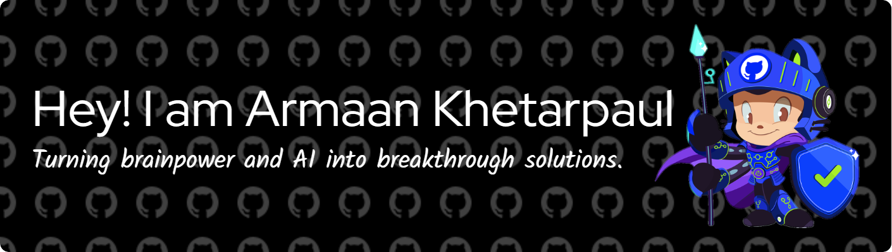

# Hello World! 👋

🎓 Final-year **B.Tech student in Mathematics and Computing** at **IISc Bangalore**  
🔭 Specializing in **Computer Vision**, **Machine Learning**, and **Artificial Intelligence**  

💡 Experienced in developing and deploying models for:
- **Bias detection in facial recognition**
- **Unsupervised anomaly detection for semiconductors**
- **Sports analytics and computer vision pipelines**
- **LLM-based systems and federated learning**

🧠 Passionate about **representation learning**, **graph neural networks**, and **explainable AI** — bridging the gap between **research** and **real-world applications**  

🌐 **Portfolio:** [armxyz1.github.io/portfolio](https://armxyz1.github.io/portfolio)  
💼 **LinkedIn:** [linkedin.com/in/armaank-ai](https://linkedin.com/in/armaank-ai)  
😄 **Pronouns:** He/Him

## Reach out
          

 ## Stats for nerds
 

 

## Random Joke

